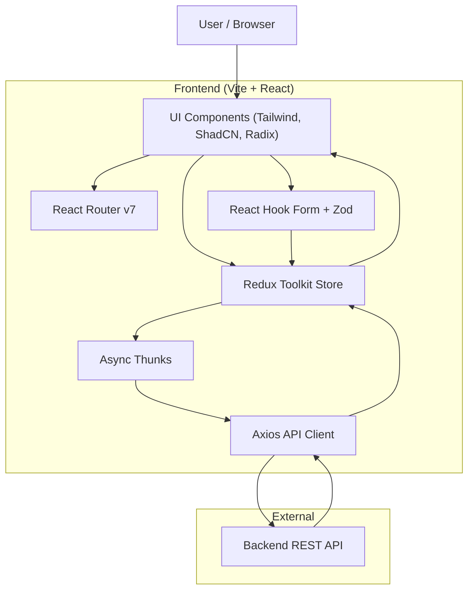

## 🏗 Architecture Diagram

---

## 🔎 Architectural Explanation

### 1. Presentation Layer

- UI Components handle rendering and user interaction.
- Styled using TailwindCSS and component primitives.
- React Router manages navigation and route protection.

### 2. State Management Layer

- Redux Toolkit manages global state.
- Async Thunks handle asynchronous operations.
- Centralized store ensures predictable state flow.

### 3. Data Layer

- Axios handles HTTP communication.
- API integration uses token-based authentication.
- All side effects are isolated inside async thunks.

### 4. Validation Layer

- React Hook Form manages form state.
- Zod enforces schema-based validation.

---
